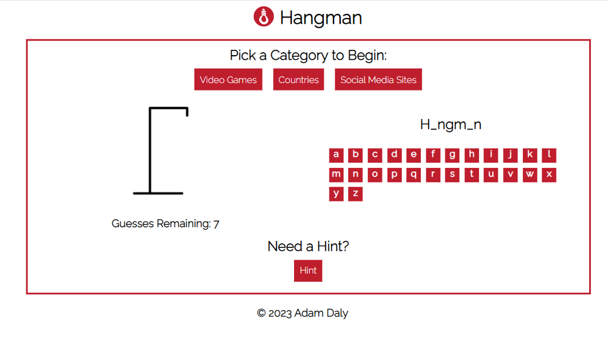
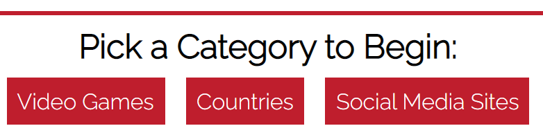
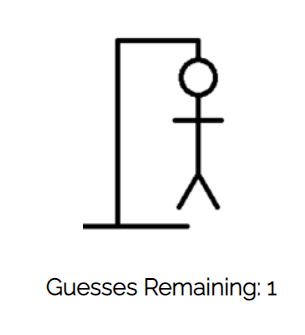
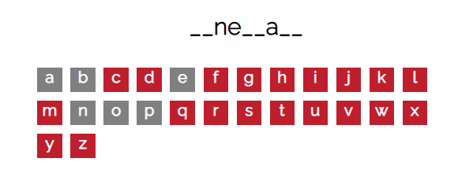
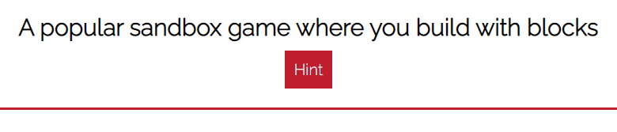
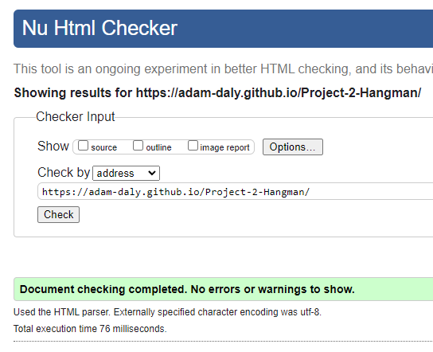
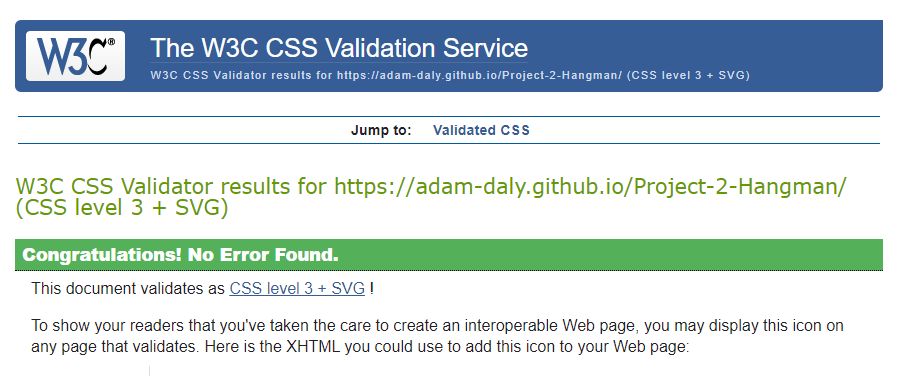

# Hangman

This project aims to recreate the game "Hangman" with a minimal aesthetic, dynamic images and life counter and some simple category and hint options.

## Features 

### Existing Features

- __Hangman Logo and Heading__

  - A simple but iconic logo to represent the game and a googlefont heading give a minimal aesthetic.

- __The Categories__

  - The user can see three categories and an indication that this is where to start. Clicking on one of them will prep the game area with a hidden word but reveal the word length. It will also clear the board in any state and get back to a fresh state, ready to play. The letters are reset to red, the images reset to the beginning, the hint is hidden and changed to the new word and the guess attempts are reset to 7.

- __The Hangman State section__

  - The image of the eponyous hangman, the images dynamically change every time an incorrect guess is taken. There are 7 images building up the hangman piece by piece and then 1 final image showing the fail state of the poor hangman if you fail to guess the word after 7 incorrect letters. Undeneath is a number of how many guesses you have left.

- __The Game Area__

  - This section has the word you are guessing itself and shows you the length of the word, as well as the letters of the alphabet to click for each attempt. The letters grey out and cannot be guessed twice to prevent wasting guesses or time. 

- __The Hint Area__

  - This section has a hidden hint that the user can click on to help with guessing the words. The hint is reset and hidden when you choose a category.

### Features Left to Implement

- Separate the reset feature from the category feature.
- Add more categories and ways to expand on lists of words that can be used.
- Add more variety of images so you get different hangmen or themed images depending on the category.
- Automatically pick a new category and reset on win.

## Testing 

Using chrome dev tools the hangman site was tested in responsive, 4k, iphone XE, iphone SR, iphone 12, samsung galaxy s8, samsung galaxy s20, ipad air and ipad mini to ensure the layout was suitably responsive and there were no out of place elements.

[iPhone 12](assets/images/media/iphone-12.png)

[Samsung Galaxy S8](assets/images/samsung-galaxy-s8.png)

[iPad Air](assets/images/iPad-Air.png)

### Validator Testing 

- HTML
    - No errors were returned when passing through the official [W3C validator]!!
- CSS
    - No errors were found when passing through the official [(Jigsaw) validator]
- JavaScript
    - No errors were found when passing through the official [Jshint validator](https://jshint.com/)
      - Some warnings were found
        - 38 Functions declared within loops referencing an outer scoped variable may lead to confusing semantics. (selectWord, category)
        - 35	The body of a for in should be wrapped in an if statement to filter unwanted properties from the prototype.
      - The following metrics were returned: 
        - There are 8 functions in this file.
        - Function with the largest signature take 1 arguments, while the median is 0.
        - Largest function has 26 statements in it, while the median is 7.
        - The most complex function has a cyclomatic complexity value of 7 while the median is 2.

### Unfixed Bugs

- Due to not fully separating the reset feature from the category buttons, the game starts in a state where you cannot instantly play without clicking the category buttons to play which may cause some users to try to start playing right away without reading the text indicating to click the category. 

- Related to this, the letters turn gray giving misleading feedback before you click a category.

## Deployment

- The site was deployed to GitHub pages. The steps to deploy are as follows: 
  - In the GitHub repository, navigate to the Settings tab 
  - From the source section drop-down menu, select the Master Branch
  - Once the master branch has been selected, the page will be automatically refreshed with a detailed ribbon display to indicate the successful deployment. 

The live link can be found here - https://adam-daly.github.io/Project-2-Hangman/

## Credits 

### Content 

- Flexbox css: https://www.w3schools.com/css/css3_flexbox_container.asp
- HTML Framework and Javascript starting point: Code Institutes Love Maths Project
- Hangman Specific Help :
    - https://codepen.io/cathydutton/pen/JjpxMm
    - https://www.youtube.com/watch?v=T6uht1A0114

### Media

- Hangman Logo : https://www.iconfinder.com/iconsets/brain-games
- Hangman Stages: https://thecityofregalia.tumblr.com/post/94905917024/hangman
